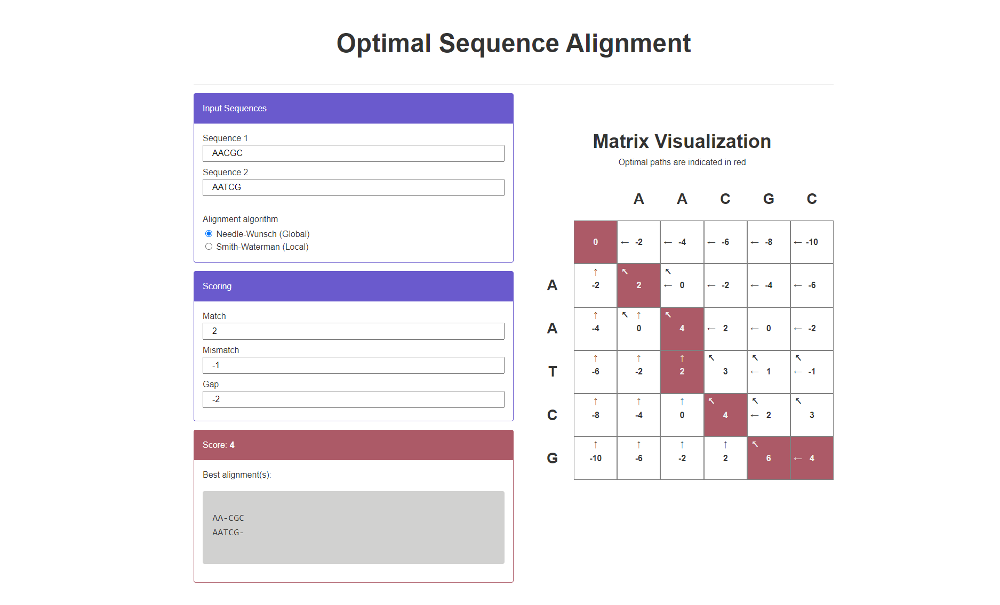

# Optimal Pairwise Sequence Alignment
Implementation of the Needleman-Wunsch and Smith-Waterman algorithms as an interactive website.

[kyleba2.github.io/sequence-alignment](https://kyleba2.github.io/sequence-alignment/)

Features:
- Dynamic programming matrix visualization updates in real-time
- Shows ALL optimal paths (performed using a depth-first search)
- Adjustable parameters
- Pure, vanilla HTML/CSS/Javascript
- Mobile friendly

